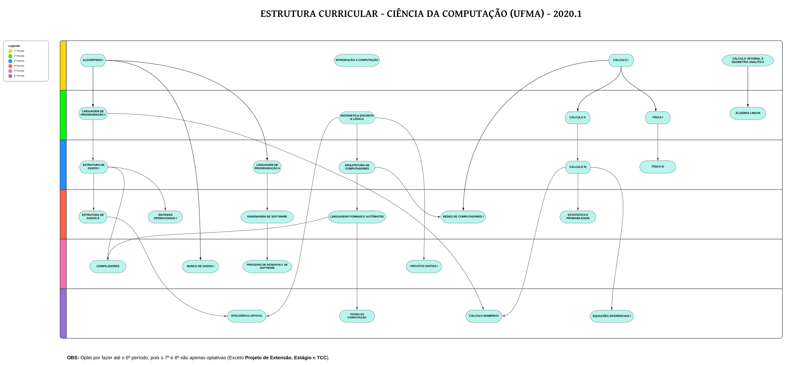

# Estrutura Curricular - Ciência da Computação - 2020.1

Este repositório contém um diagrama da estrutura curricular do curso de Ciência da Computação, desde o 1º até o 6º período. O diagrama representa todas as disciplinas obrigatórias do curso.

## Propósito

O propósito deste repositório é fornecer uma representação visual da organização das disciplinas obrigatórias ao longo dos períodos do curso de Ciência da Computação. Isso pode ser útil para estudantes, professores e outros interessados em entender a sequência de matérias ao longo do curso.

## Como Usar

- **Diagrama:** O arquivo "Diagrama.svg" contém o diagrama da estrutura curricular. Você pode visualizá-lo diretamente no GitHub ou fazer o download para visualização offline.

## Contribuições

Contribuições são bem-vindas! Se você encontrar algum erro ou tiver sugestões de melhoria para o diagrama, sinta-se à vontade para abrir uma issue ou enviar um pull request.

## Licença

Este projeto está licenciado sob a [Licença MIT](LICENSE).
